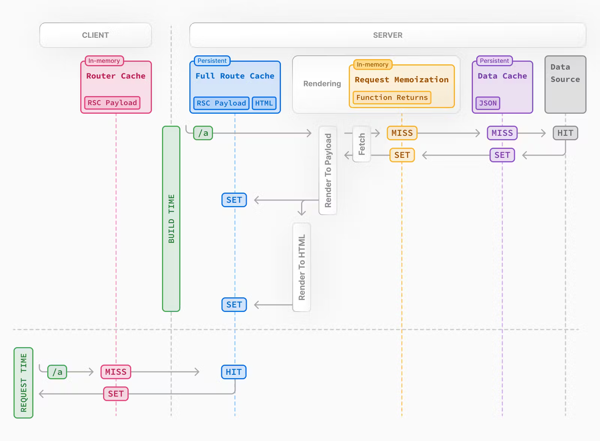

# Performance comparison: Next.js alongside Fargate, Lambda and Lambda@Edge

**Hosting [Next.js](https://nextjs.org/) isn't just about Vercel.** Sure, Vercel is the first and most straightforward option that comes to mind when deploying your Next.js app. Their support for Next.js is unbeatable and offers a fantastic developer experience. Moreover, thanks to their free tier, you can host smaller (non-commercial) websites for free!

…but, maybe you heard that:

- The costs of hosting on Vercel can snowball once you are out of their free tier.
- You can **easily host your Next.js app on AWS (almost) for free** using AWS Lambda.
- Sometimes, it makes more sense to use containers instead of serverless for Next.js.

Today, I am touching on all of the points above. I will discuss options to self-host Next.js as an alternative to using managed solutions like Vercel.

I'm mostly focusing on how Next.js can smoothly integrate with key [AWS](https://aws.amazon.com/) services:

- **[Lambda](https://aws.amazon.com/lambda/)**,
- **[Lambda@Edge](https://aws.amazon.com/lambda/edge/)**,
- **[Fargate](https://aws.amazon.com/fargate/)**.

Opting for these services over managed solutions like Vercel can bring you greater flexibility and significant cost savings.

In this post, I’ll be deploying the same Next.js app using these AWS services, running a bunch of performance tests, and then crunching the numbers to figure out the costs for each setup. Ready to see how it goes?

## Deployment options

As mentioned above, this post will focus on self-managed hosting using AWS. However, to give a complete picture to those new to Next.js, this section briefly introduces the deployment options for hosting your Next.js app.

There are two main paths:

1. **Fully managed solutions** that take care of everything for you (but can have some disadvantages in the long run).
2. **Self-managed setups** that give you the reins (a bit harder to start with, but nowadays they can be hassle-free too).

### 1. Fully managed solutions

For deploying Next.js apps, the Vercel mentioned above is the most obvious choice. It's built by the same folks who created Next.js, so you get a smooth experience, easy scaling, and more right out of the box. [Netlify](https://www.netlify.com/) offers a similar easy setup with plenty of features.

I've personally used both Vercel and Netlify for various projects. But there are a couple of things to keep in mind:

- Costs can jump quickly once you move beyond the free tier.
- Vercel's free tier won't let you run ads on your site (the free tier is for non-commercial sites only).
- Need a private VPC for extra security or compliance? You might be looking at a pricey enterprise plan.

So, what do you do if managed solutions don't fit your needs? That's where self-hosting comes into play.

### 2. Self-managed setup

If you choose not to go down the fully managed route, you can always self-host your app on a cloud/service of your choice (in this post, we will focus on AWS). Self-hosting's got a couple of big perks:

- **Flexibility**: Easily connect your app with any AWS service or backend.
- **Cost-effective**: Generally cheaper than Vercel or Netlify, especially as you grow.

 

So, how can I take my Next.js app and self-host it without using platforms such as Netlify or Vercel?

 

Next.js suggests **containerizing your app**. There are many tutorials on creating a container image for your Next.js app. Once you have the image, you can host it on any container platform.

**But here's the catch**: While Vercel and Netlify offer free hosting for low-traffic sites, running a container on AWS means you'll pay regardless of traffic.

That's why some developers have looked into **hosting Next.js apps on AWS Lambda** - to cut costs and get the perks of being serverless, like paying per request and instant scaling on demand.

However, getting a Next.js app to run on Lambda isn't always straightforward due to the framework's complexities.

Thankfully, tools like [Stacktape](https://stacktape.com/) and [SST](https://sst.dev/) simplify this process. They leverage [OpenNext](https://open-next.js.org/), an open-source adapter that makes Next.js apps Lambda-friendly — props to the OpenNext team and community for making serverless Next.js a reality.

---

## Test environments

Now, it is time to see how our AWS self-managed environments fare against each other.

We're putting 3 Next.js deployment setups to the test:

| #   | Environment type          | Configuration                             | Example Project                                                                      |
| --- | ------------------------- | ----------------------------------------- | ------------------------------------------------------------------------------------ |
| 1   | AWS Lambda                | 1024 MB memory, built with OpenNext       | [example project](https://github.com/stacktape/starter-nextjs-ssr-website-lambda)    |
| 2   | AWS Lambda@Edge           | 1024 MB memory, built with OpenNext       | [example project](https://github.com/stacktape/starter-nextjs-ssr-website-lambda)    |
| 3   | AWS ECS Fargate container | 0.5 CPU, 1024 MB memory, HTTP API Gateway | [example project](https://github.com/stacktape/starter-nextjs-ssr-website-container) |

All setups are in the `eu-west-1` (Ireland) region. However, Lambda@Edge is a bit different—it's distributed globally and is always executed in the region closest to the application user.

> Since I'm focusing on compute engines' performance, I'll send requests straight to Lambda/Container origins (bypassing CDN). This mimics how CloudFront (CDN) interacts with these origins.
>
> To do this, I've got two EC2 instances ready: one in `eu-west-1` and another in `us-east-1`.
>
> **How we sent requests**:
>
> - To Containers, through `HTTP API Gateway`, directing traffic straight to them.
> - To Lambda setups, we used the `Lambda URL`. It's not exactly how CloudFront connects to Lambda@Edge, but it's close enough for our tests.

---

## Test 1 - Request/response time

My first set of tests evaluates the response speed of various AWS configurations under a light load. We send requests one at a time.

Tests we are making:

- For **AWS Lambda** environment:
  - **From `eu-west-1`**: This is region, where environment is deployed, mimicking a nearby user.
  - **From `us-east-1`**: This simulates a user far from the environment.
- For **AWS Fargate container** environment:
  - **From `eu-west-1`**: This is region, where environment is deployed, mimicking a nearby user.
  - **From `us-east-1`**: This simulates a user far from the environment.
- For **AWS Lambda@Edge** environment:
  - **From `us-east-1`**: This simulates a user far from the environment. However, Lambda@Edge, which is distributed globally, processes requests in the same region from which they originate.

Testing **AWS Lambda@Edge** from `eu-west-1` would be similar to the standard Lambda test, so we skip this test.

In total, there is 5 tests.

> We skipped the first response in each test to avoid measuring the [cold starts](https://docs.aws.amazon.com/lambda/latest/operatorguide/execution-environments.html#cold-start-latency) of Lambda functions. Cold starts are longer due to the size of Next.js app packages, but they're not our focus here. They can be mitigated in real apps with techniques like [using warmer](https://docs.stacktape.com/compute-resources/nextjs-website/#using-warmer).

### Results

| Environment                          | Requests from | Avg. Latency (ms) |
| ------------------------------------ | ------------- | ----------------- |
| AWS Lambda (in eu-west-1)            | eu-west-1     | 86.27             |
| AWS Lambda (in eu-west-1)            | us-east-1     | 432.91            |
| AWS Fargate container (in eu-west-1) | eu-west-1     | 57.94             |
| AWS Fargate container (in-eu-west-1) | us-east-1     | 377.83            |
| AWS Lambda@Edge (in us-east-1)       | us-east-1     | 317.45            |

Responses were fastest from servers in the same region as the request. Containers edged out Lambda in speed slightly.

**But why was Lambda@Edge slower?** The Lambda@Edge itself is executed in the region where requests originate, so one could expect it to be as fast as regular Lambda! But despite running closer to the user, its setup with OpenNext and the internal caching of Next.js impacts its speed.

### Next.js Caching

Next.js uses caching to speed up your app, save resources, and cut costs. It stores rendered pages and data with **fetch data cache** and **full route cache**. Unfortunately, this caching can affect application speed when combined with OpenNext and Lambda@Edge.

### The Lambda Cache Issue

Usually, caches live on the server hosting the Next.js app. This also applies to our **Fargate Container** setup, where the cache is stored directly in the container.

Lambda functions don't have their own persistent storage, so OpenNext uses an S3 bucket for shared cache. This means all Lambda functions can use the same cache data stored in the bucket.

But there's a catch with Lambda@Edge. **If the cache's S3 bucket is in a different region, Lambda@Edge has to fetch data across regions, causing delays.** This is why we also see increased delays in the Lambda@Edge test. Still, our tests show that Lambda@Edge is faster than sending the entire response from another region. And for routes without cache (when Lambda@Edge does not need to communicate with parts of the infrastructure in the different region), Lambda@Edge can be much quicker.

---

## Test 2 - Load Testing

In the second set of tests, we will test the different compute engines under the load.

I'll test **AWS Lambda** and **AWS Fargate container** environments from an `eu-west-1` EC2 instance:

- For load testing, I'm using [autocannon](https://www.npmjs.com/package/autocannon), a NodeJS tool, with these settings:
  - **Pipelining**: Set to 10 - allows 10 requests on the fly at once per connection.
  - **Connections**: Adjusting this changes the number of requests per second sent and the overall load. I'll test with 3, 10, 30, 50, 100, 200, 300, 500 connections.
- Each test runs for 60 seconds.
- All requests hit the root (`/`) path.

> No Lambda@Edge test—it'd be similar to the regular Lambda test.

Let's see how load affects **latency** and **error rates** and find each setup's limits.

### Test 2 - Results

Lambda environment can scale massively without much limit, giving each request full memory and CPU. This can be handy when handling heavy tasks like database operations.

In the Fargate container environment, the container resources are shared among all incoming requests. This can limit performance per request.

> Normally, you can scale containers up (more resources per container) or out (more containers for the load). For this test, I didn't scale our container to see its baseline capacity compared to AWS Lambda.

#### Lambda Results

Interestingly, Lambda showed higher latencies than expected in this test. Even though AWS Cloudwatch metrics suggest an average duration of Lambda execution to be around 25 ms, we saw an average latency of around 300ms already at low load. This would suggest that the latency delay happens not during Lambda execution but somewhere else. Whether this is due to some Lambda URL limitations, standard network delay, or something else, I was not able to find out.

Increasing the load to about 200 connections (~6000 req/sec) increased Lambda's latency. While initially, I thought that the throttling might be the cause, it wasn't clear with only two 429 errors(Throttling Error code) out of over 250,000 requests.

Further testing suggested Lambda's execution time wasn't the issue since the average of around 25ms stayed low even under heavy load. From what it looks like, Lambda's URL might be queuing requests, causing the increase in latency without sending many throttling errors. This theory matches our observations, though there's no official confirmation—just an [unanswered question on the AWS forum](https://repost.aws/questions/QUcL83FbaRTratTYprSLN-BA/lambda-function-url-throttling) with a similar question.

#### Fargate Container Results

As we increased traffic, container latency began to spike. At about 70 connections (~700 req/sec), latency hit **1 second** and then increased rapidly. The following chart shows a rise in 503 errors due to this overload.

This confirms the container can handle roughly 4500 requests per minute, aligning with our earlier ~700 req/sec estimate.

> Remember, this test's setup might differ from real-world Next.js apps. Your app, especially in production, could be doing more complex tasks like pulling data from databases or APIs, which means requests might take longer and require more resources.

---

## Pricing Comparison

In test 2, I estimated the number of requests a single container can handle per second. With this information, I can develop pricing formulas to see when it is better to use Containers or Lambdas.

I will be calculating prices for these 4 environments:

1. AWS Lambda (using OpenNext)
2. AWS Lambda@Edge (using OpenNext)
3. Fargate container + HTTP API Gateway
4. Fargate container + Application Load Balancer

> I've included `Fargate container + Application Load Balancer` for a fuller comparison, even though it wasn't used in the initial tests. In previous tests we only used the HTTP API Gateway setup but Gateway can easily be swapped by Application Load Balancer. We include this environment, to see how the different pricing schema of Load Balancer (compared to HTTP API Gateway) can influence the final price.

### 1. Lambda Environment Cost

AWS pricing details:

- **Execution Cost**: About $0.0000000167 for 1ms of use with 1024MB memory.
- **Request Cost**: $0.20 per million requests.
- **S3 Costs**: $0.0004 for 1000 GET requests and $0.005 for 1000 PUT requests.

Monthly cost breakdown (x = monthly requests):

|     | Formula                                               | Description                                                 |
| --- | ----------------------------------------------------- | ----------------------------------------------------------- |
| +   | `average_lambda_function_duration * 0.0000000167 * x` | Execution time cost                                         |
| +   | `0.0000002 * x`                                       | Cost per request                                            |
| +   | `x * 0.0004 / 1000 + x / 50 * 0.005 / 1000`           | S3 bucket cost (1 GET per request, 1 PUT every 50 requests) |

### 2. Lambda@Edge Environment Cost

AWS pricing details:

- **Execution Cost**: Roughly $0.00000005001 per ms for 1024MB memory.
- **Request Cost**: $0.60 per million requests.
- **S3 Costs**: Same as Lambda - $0.0004 for 1000 GET and $0.005 for 1000 PUT requests.

Monthly cost formula (x = monthly requests):

|     | Formula                                                | Description                                                 |
| --- | ------------------------------------------------------ | ----------------------------------------------------------- |
| +   | `average_lambda_function_duration * 0.00000005001 * x` | Execution time cost                                         |
| +   | `0.0000006 * x`                                        | Cost per request                                            |
| +   | `x * 0.0004 / 1000 + x / 50 * 0.005 / 1000`            | S3 bucket cost (1 GET per request, 1 PUT every 50 requests) |

### 3. Fargate Container + HTTP API Gateway Cost

AWS pricing details:

- **Fargate Container**: About $0.0244/hour, which is roughly $17.5 per month.
- **HTTP API Gateway**: $1 per million requests.

Here's how to calculate monthly costs (x = number of requests per month):

|     | Formula                                                                              | Description                                         |
| --- | ------------------------------------------------------------------------------------ | --------------------------------------------------- |
| +   | `17.5 * ceil((x+1) / (2592000 * number_of_req_per_sec_handled_by_single_container))` | Cost of running Fargate (2592000 seconds = 1 month) |
| +   | `x / 1000000`                                                                        | Cost for using HTTP API Gateway                     |

### 4. Fargate Container + Application Load Balancer Cost

AWS pricing details:

- **Fargate Container**: Around $0.0244/hour, so $17.5 per month.
- **Application Load Balancer**: A fixed fee of $16.2 plus $0.008 per LCU hour, totaling about $5.76 a month for LCUs.

Monthly cost formula (x = number of requests per month):

|     | Formula                                                                              | Description                                                         |
| --- | ------------------------------------------------------------------------------------ | ------------------------------------------------------------------- |
| +   | `17.5 * ceil((x+1) / (2592000 * number_of_req_per_sec_handled_by_single_container))` | Cost for Fargate container, considering a month has 2592000 seconds |
| +   | `16.2`                                                                               | Monthly fixed fee for Application Load Balancer                     |
| +   | `x / (2592000 * 1000) * number_of_lcus_needed_for_thousand_req_sec * 5.76`           | Additional fee for LCUs based on usage                              |

### Pricing Comparison Results

I introduced new constants in the formulas. For formulas to be complete, we have to set these constants to specific values. I will also adjust them later on to show how they influence the final results:

- `average_lambda_function_duration` - In the test, the average lambda duration was around 27ms. However, the average lambda duration might be higher in real scenarios since you will generate more complex websites and fetch data from APIs and databases. We will set it to **50ms** for this simulation.

- `number_of_lcus_needed_for_thousand_req_sec` - we will set this to **50**. This can be more or less according to the amount of data you will be transferring on average in each request.

- `number_of_req_per_sec_handled_by_single_container` - In the test, the container was able to handle more than 500 req/sec. However, as with the `average_lambda_function_duration`, these values might differ in production due to more complex operations. We will set this to **100**.

We can see that if the average load is low, Lambda is cheaper. This makes it ideal for sites where CDN caching handles most content.

But as Lambda functions get busier, costs rise. More traffic to your Next.js app could mean:

- Skipping CDN caching,
- Short cache revalidation times,
- Frequent uncachable API calls.

**According to my calculation, already at 3 req/sec for Lambda@Edge and 9 req/sec for Lambda, switching to container setups might be cheaper.**

> Note: Many sites won't hit these traffic levels to the server due to CDN caching, making Lambda cost-effective.

Understandably, changing constants like `average_lambda_function_duration`, `number_of_req_per_sec_handled_by_single_container`, or cache request rates will affect your costs.

Here's another comparison with `average_lambda_function_duration` at **30ms** and `number_of_req_per_sec_handled_by_single_container` at **50**:

Remember, these estimates don't cover AWS Data Transfer fees, which are similar across all environments and don't significantly impact cost comparison.

---

## Conclusion

Our exploration into Next.js hosting on AWS has given us valuable insights into how different setups perform. It's important to note, though, that your app might see different results based on a variety of factors.

Here are the main points we've learned:

**Lambda is great when:**

- You're not hitting 5-10 requests per second all the time, which is common since CDN caching helps reduce direct hits to your Lambda.
- You need to scale up fast because of unpredictable traffic. Lambda can handle this automatically.
- Watch out for Lambda@Edge costs if your app serves users globally. It's efficient but can get expensive.

**Containers might be better if:**

- You've got steady traffic over 5-10 requests per second.
- You're looking to avoid the delay from Lambda's cold starts.
- Your app sees consistent traffic without big jumps, fitting the container's scaling model.

Appreciate you sticking around till the end! If you catch any mistakes in our data or you're curious about other comparisons, just shout.
